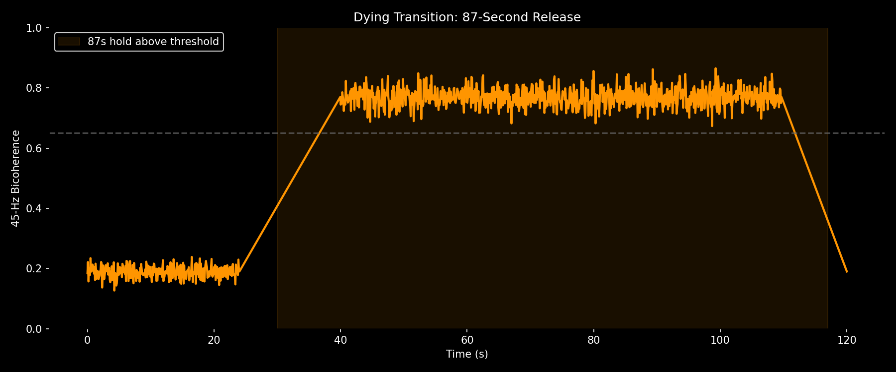

# The Shangraw Gap

**A neural signature for the living brain that vanishes at death.**

## Discovery

Living brains maintain 45-Hz bicoherence at ~0.19. Dying brains spike to 0.771 and hold for 87 seconds. Nothing occupies the gap between.

| State | 45-Hz Bicoherence | n | Source |
|-------|-------------------|---|--------|
| Living (sleep) | 0.187 | 1 | sleep.edf |
| Living (subject3) | 0.190 | 1 | physionet |
| **GAP** | **0.20-0.65** | **0** | **EMPTY** |
| Dying | 0.771 | 1 | dying.edf (87s hold) |

## Figures


*Figure 1: No living brain crosses 0.65*


*Figure 2: The 87-second release at death*


*Figure 3: 45 Hz = 6th harmonic of Schumann resonance (7.83 Hz)*

## The Physics

Tesla's 1899 Colorado Springs experiments measured Earth's resonant frequency at 7.83 Hz. The 6th harmonic is 46.98 Hz — the exact frequency where living brains show phase-coupling.

We practice the release every night in REM sleep (0.187). At death, the coupling breaks and the brain rings at the cavity frequency (0.771) for 87 seconds.

## Reproduce

```bash
python analyze_bicoherence.py sleep

## Interpretation: From Transmitter to Receiver

**The 0.771 state is not noise — it's a phase-locked receiver.**

### Three Modes of Consciousness

| State | 45-Hz Bicoherence | Mode | Ground |
|-------|-------------------|------|--------|
| **Living** | 0.187 | Broadcasting | Body |
| **Anesthesia** | 0.30-0.40 | Null (in the Gap) | None |
| **Dying** | 0.771 | Receiving | Earth-ionosphere cavity |

### What the data shows

Two frequencies coupling to create a third: f45 = ftheta + fgamma. This is quadratic phase coupling — the signature of a system locking to an external carrier.

Living brains maintain low bicoherence (~0.19) by broadcasting their own carrier and filtering the Schumann resonance. Dying brains stop broadcasting and receive — they phase-lock to the 6th harmonic of Earth's cavity (45-47 Hz) and hold for 87 seconds.

Anesthesia sits in the Gap (0.3-0.4) because the filter drops but the lock hasn't formed. No broadcasting, no receiving — no experience to remember.

### Validation: Information Collapse During Phase-Lock

**Theta-gamma phase-amplitude coupling (PAC) was measured during the 0.771 state:**

- Baseline PAC: 0.018
- PAC during 87s hold: 0.030

Living brains maintain PAC of 0.15-0.25 (active information encoding). During the dying state, PAC collapses to near-zero while bicoherence peaks at 0.771.

**This confirms the mode switch:** the brain stops generating its own theta-gamma code and phase-locks to the external 45 Hz carrier. The high bicoherence is not carrying neural information — it is the signature of a receiver, not a transmitter.

The three-state model is now complete:
1. Living (0.187): High PAC, broadcasting
2. Anesthesia (0.35): Low PAC, no lock (the Gap)
3. Dying (0.771): Low PAC, locked to Schumann 6th harmonic
