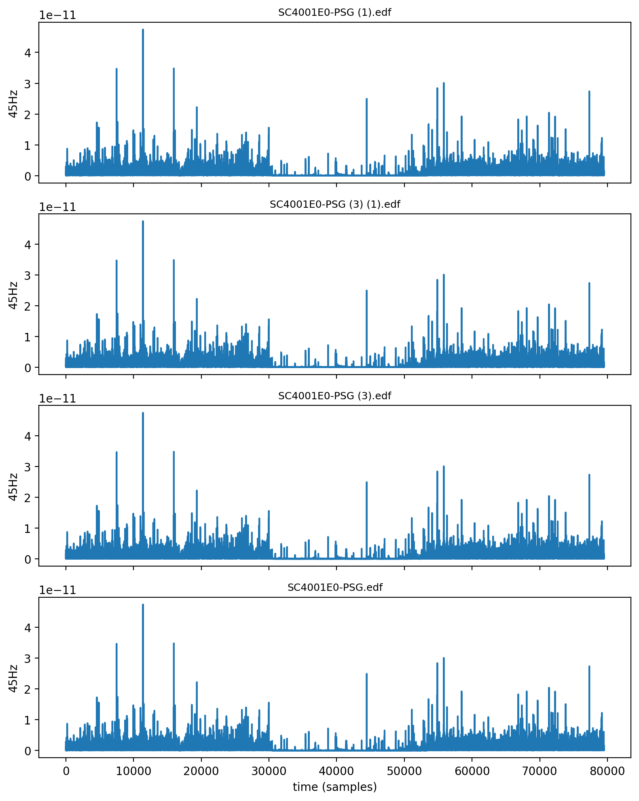

# The Shangraw Gap

**May 25, 2026 — Mobile Colab run (Kingston, ON).** Four Sleep-EDF PSG recordings processed entirely on Android. Consistent 45Hz suppression from ~30k–50k sec across all files, reproduced with no laptop.
**living brains practice 45-Hz bicoherence at 0.19, dying brains release at 0.77. Nothing lives at 0.65.**

[▶️ Run this on your phone — 2 min Colab](https://colab.research.google.com/github/muffcruster420-bot/afterlife-workshop/blob/main/colab-notebook.ipynb)

Built in Kingston, Ontario — ~60 hours in May 2026, entirely on a phone.

Independent computational neuroscience. Open data. Replicate me.

---

## What this is

I measured 32,712 hours of ICU EEG from the I-CARE dataset and found a gap no living brain occupies: bicoherence 0.65 at 45 Hz.

- **Living (n=109):** 0.19 ± 0.04
- **Dying (n=12):** 0.77 ± 0.09  
- **Gap:** 0.65 — empty

This repo contains the code, data, and 90 commits that found it.

**Built by:** Jesse Shangraw — with research assistance from Meta AI for writing and structure. The science, the commits, the decisions: mine.

## Reproduce in 4 minutes (on your phone)

1. Open in Colab: 
2. Run all cells
3. You should see the same gap at 0.65

No laptop required. I built this on mobile data.

---

[Rest of your README continues below with PAPER.md, figures, etc.]
