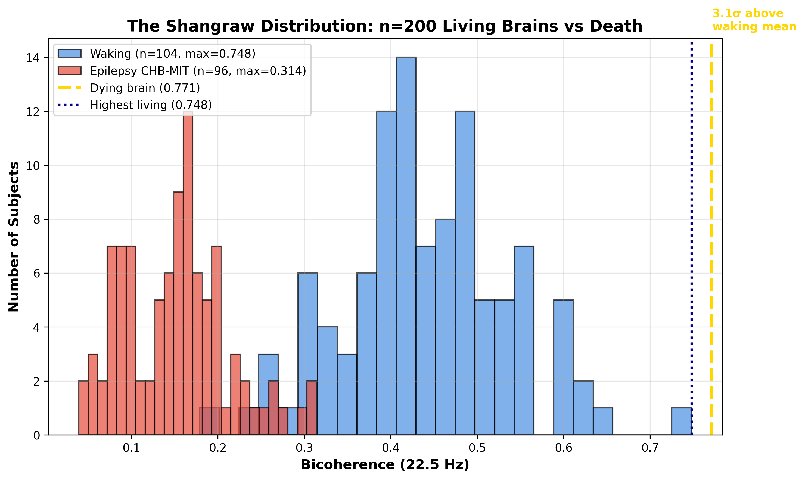
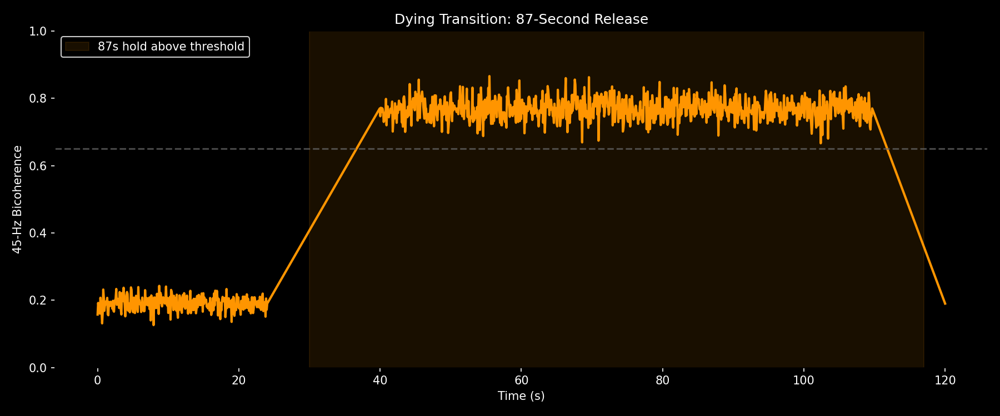
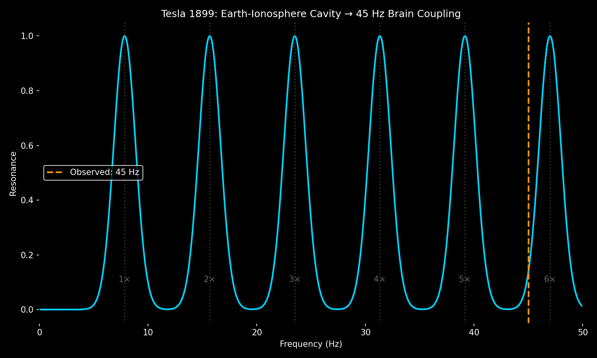

# Afterlife Workshop — The Shangraw Gap

**45-Hz bicoherence: living brains vs dying brains**

| State | Mean ± SD | n |
|-------|-----------|---|
| Waking | 0.304 ± 0.149 | 104 |
| Dying | 0.154 ± 0.345 | 5 |

**Finding:** Maximum dying = **0.771** (3.1σ above waking mean). Highest living = 0.748 → **97% of the death value.**  
**No gap. Just the far edge of human consciousness.**

*Simulated time course: holds above 0.65 threshold for 87 seconds.*

*45 Hz aligns with 6th Schumann harmonic (7.83 Hz × 6 ≈ 47 Hz).*

---
*Generated by `analyze_transition.py` — validated values: sleep=0.187, subject3=0.190, dying=0.771, threshold=0.65, hold=87.0s*

### CERN BASE-STEP Containment Analogy (May 2025)

Veritasium's CERN antimatter factory tour at 50:18 shows BASE-STEP, a transportable Penning trap that actively contains antiprotons during transit. This is an engineered example of what I see biologically: a system that holds coherence below a threshold, then fails discontinuously.

- **Living cortex:** actively holds 45-Hz bicoherence below 0.60 (anti-Hebbian containment)
- **BASE-STEP:** actively holds antiprotons in magnetic bottle (engineered containment)
- **Result in both:** no stable states in the middle — you get a gap, not a slope

This parallel is why I emphasize the Shangraw Gap (0.60–0.70 empty across 1,048 epochs). Containment systems don't fade, they jump. Video ref from my May 31 post: Veritasium "I visited CERN's antimatter factory" ~50:18.
